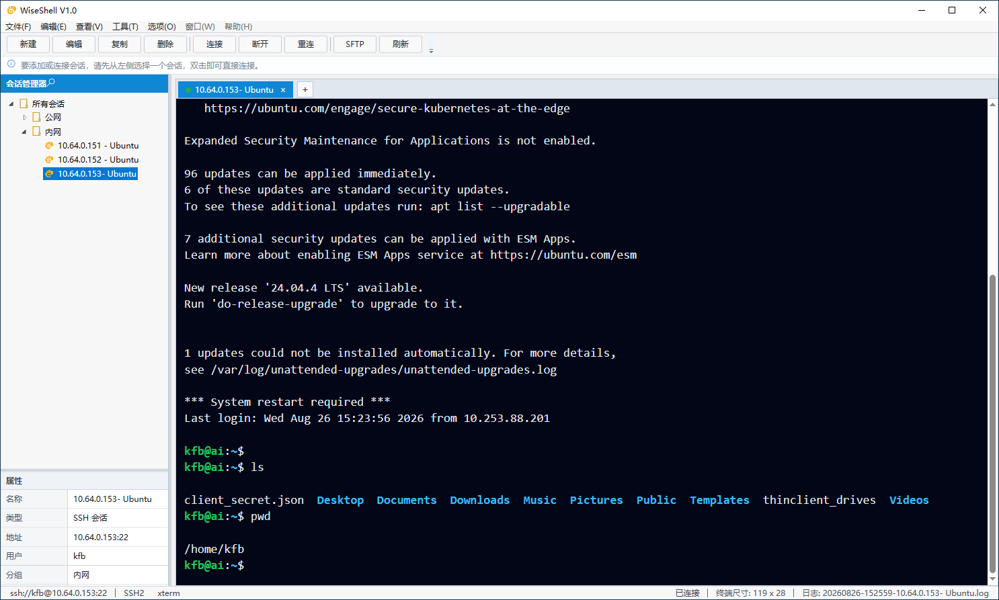
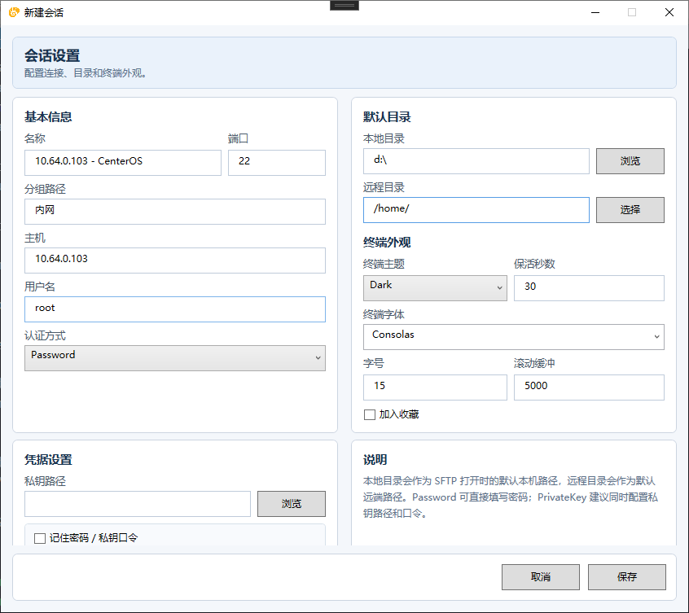

# WiseShell

WiseShell 是一个面向 Windows 的 SSH/SFTP 桌面客户端，基于 `.NET 8`、`WPF`、`WebView2` 和 `SSH.NET` 构建。它专注于常用服务器运维场景：管理 SSH 会话、打开远程终端、浏览和传输 SFTP 文件，并安全保存连接凭据。


## 界面预览





## 功能特性

### SSH 终端

- 支持通过 SSH 打开远程交互式终端。
- 支持常用键盘输入，包括字符输入、回车、Tab、方向键、Home、End、Delete、PageUp 和 PageDown。
- 支持 `Ctrl+C`、`Ctrl+V` 等常用复制粘贴操作。
- 支持窗口尺寸同步，终端区域大小变化后会自动通知远端 Shell。
- 支持终端输出滚动缓冲，便于查看历史输出。
- 支持 ANSI 颜色渲染，`ls --color` 等命令输出的目录、可执行文件和提示符颜色可以正常显示。
- 支持终端主题、字体、字号和滚动缓冲行数配置。
- 支持连接状态提示，包括连接中、已连接、异常和已断开。
- 支持终端日志写入，便于后续排查和记录操作过程。
- 支持配置远程启动目录，连接成功后自动进入指定目录。

### 会话管理

- 支持创建、编辑、复制、删除和重命名 SSH 会话。
- 支持会话分组，适合按环境、项目、客户或服务器类型整理连接。
- 支持收藏常用会话，便于快速访问高频服务器。
- 支持会话树浏览，分组和会话可以集中管理。
- 支持拖拽移动会话或文件夹，快速调整分组结构。
- 支持内联重命名会话或文件夹。
- 支持配置主机、端口、用户名、认证方式、私钥路径、保活间隔、本地默认目录和远程默认目录。
- 支持按会话单独设置终端主题、字体、字号和滚动缓冲。
- 支持全局终端默认设置，并可选择应用到仍使用旧默认值的会话。

### 认证与凭据

- 支持密码认证。
- 支持私钥认证，并可配置私钥口令。
- 支持选择是否记住密码或私钥口令。
- 使用 Windows DPAPI 加密保存凭据，凭据与当前 Windows 用户绑定。
- 支持编辑会话时更新已保存凭据。
- 支持连接失败后清理错误的运行时密码缓存，避免一直复用错误密码。
- 支持取消记住凭据后删除已保存密码。

### 主机指纹信任

- 首次连接未知主机时会提示确认主机指纹。
- 已确认的主机指纹会保存到本地 `known-hosts.json`。
- 后续连接同一主机时会复用信任记录，减少重复确认。
- 通过主机指纹确认降低误连或中间人攻击风险。

### SFTP 文件管理

- 支持从当前 SSH 会话直接打开 SFTP 文件浏览器。
- 支持独立建立 SFTP 连接，并复用会话认证信息。
- 支持远程目录浏览，目录优先排序。
- 支持本地目录浏览，提供本地与远程双栏文件管理体验。
- 支持上传文件和目录。
- 支持下载文件和目录。
- 支持远程文件或目录删除。
- 支持远程文件或目录重命名。
- 支持远程新建目录。
- 支持本地文件或目录删除、重命名。
- 支持刷新本地目录和远程目录。
- 支持默认本地目录和默认远程目录，打开 SFTP 后可自动定位。
- 支持传输进度显示，包括已传输大小、总大小、百分比和速度。
- 支持传输队列，多个上传/下载任务可以排队执行。
- 支持取消正在进行或排队中的传输。
- 支持传输日志，记录上传、下载、失败、取消等状态。
- 支持最多保留最近传输记录，避免日志无限增长。

### 本地数据与日志

- 会话、分组和终端默认配置保存到本地 JSON 文件。
- 凭据单独保存，并通过 Windows DPAPI 加密。
- 主机指纹信任记录单独保存，便于维护。
- 终端日志按会话和时间生成，便于回溯。
- 应用数据默认存放在 `%APPDATA%\WiseShell`。

### 桌面体验

- 基于 WPF 构建原生 Windows 桌面应用。
- 使用 WebView2 承载终端渲染，兼顾文本显示、颜色渲染和复制粘贴体验。
- 支持浅色、深色和 Solarized 终端主题。
- 支持推荐等宽字体选择，也允许手动输入字体名称。
- 支持状态栏展示当前会话、连接地址、终端尺寸和日志状态。

## 项目结构

```text
WiseShell
├─ WiseShell.App                 # WPF 桌面应用和界面层
├─ WiseShell.Core                # 核心模型、接口、本地存储和公共逻辑
├─ WiseShell.Transport.SshNet    # 基于 SSH.NET 的 SSH/SFTP 传输实现
├─ WiseShell.Tests               # 单元测试和集成测试桩
├─ WiseShell.sln                 # Visual Studio 解决方案
└─ WiseShell.slnx                # 新版解决方案文件
```

## 运行环境

- Windows 10/11
- .NET 8 SDK
- Microsoft Edge WebView2 Runtime

## 快速开始

还原依赖并构建：

```powershell
dotnet build .\WiseShell.sln
```

运行应用：

```powershell
dotnet run --project .\WiseShell.App\WiseShell.App.csproj
```

运行测试：

```powershell
dotnet test .\WiseShell.Tests\WiseShell.Tests.csproj
```

## 本地数据

WiseShell 默认将用户数据保存在：

```text
%APPDATA%\WiseShell
```

主要文件包括：

- `sessions.json`：会话、分组、终端外观等配置。
- `credentials.json`：通过 Windows DPAPI 加密保存的凭据。
- `known-hosts.json`：已信任的主机指纹。
- `Logs\`：终端日志目录。

## 安全说明

- 凭据通过 Windows DPAPI 按当前用户加密，离开当前 Windows 用户上下文后无法直接解密。
- 首次连接未知主机时，应用会提示确认主机指纹。
- 如果密码认证失败，应用会清理错误的运行时密码缓存，方便重新输入正确密码。

## 技术栈

- .NET 8
- WPF
- Microsoft.Web.WebView2
- SSH.NET
- xUnit

## 开发备注

当前项目仍在持续迭代中。提交代码前建议至少执行：

```powershell
dotnet test .\WiseShell.Tests\WiseShell.Tests.csproj
```
